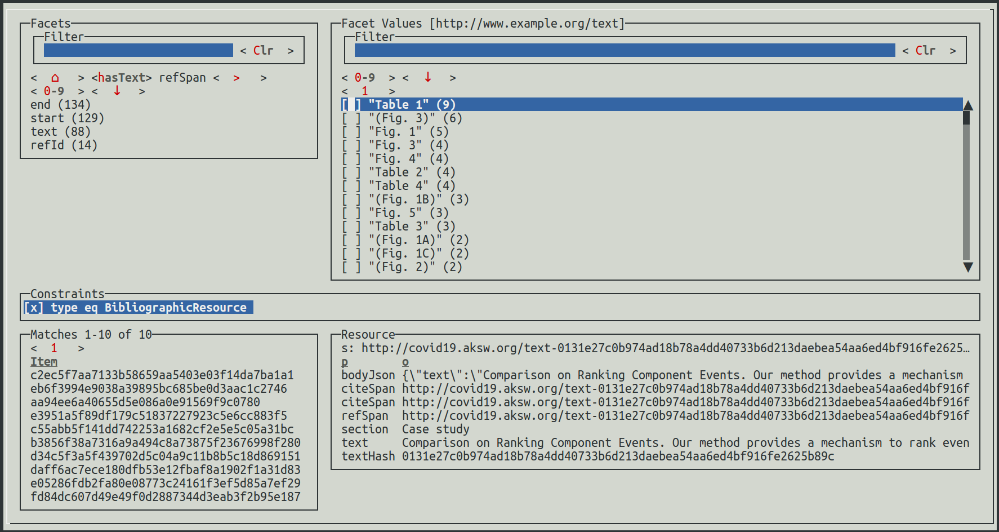

# cord19-rdf



```
cd target
Download data from https://www.kaggle.com/allen-institute-for-ai/CORD-19-research-challenge/download
unzip in the target folder (which is in .gitignore)
```

Schema at https://ai2-semanticscholar-cord-19.s3-us-west-2.amazonaws.com/2020-03-13/json_schema.txt


### Creation of the Initial Data
The raw data resides in many JSON files. It is more convenient to work on an initial RDF dataset instead of repeatedly creating it:
So let's create a sample of named graphs which contain the raw JSON:

```bash
sparql-integrate map-to-graph.sparql | ngs head -n 1000 > data-1000.trig
```

### RDFizing the JSON in the Named Graphs


```bash
# cleanup removes intermediate properties, gspo.sparql yields the actual output; it is actually a resource on the classpath
ngs map \
  --sparql rdfize-texts.sparql \
  --sparql rdfize-authors.sparql \
  --sparql cleanup.sparql \
  --sparql gspo.sparql \
  data-1000.trig | ngs head -n 100 > data.trig
```

